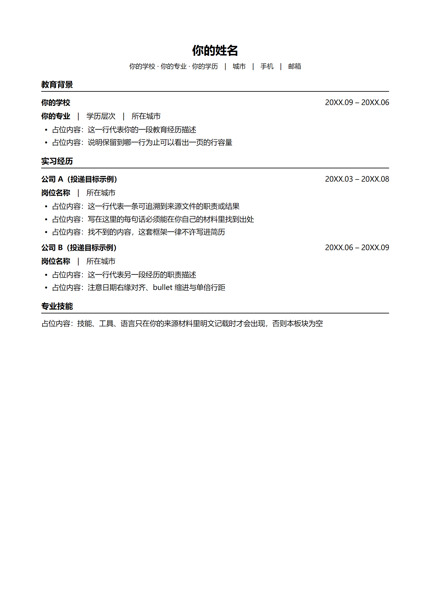

# resume-rolepack


**A role-aware, provenance-enforced resume framework for AI agents.**
一个给 AI 用的改简历框架：**写进简历的每一句话，都必须能在你自己的材料里找到出处。**

用 AI 改简历最常见的问题不是文笔，而是编造：把「参与」写成「负责」，
把在会上听过一次的数字写成自己的业绩。面试被追问两句就答不上来。

## 架构

**一次初始化 + 四种模式**

**初始化 —— 首次使用一次**

第一次对话走一圈向导：问简历原件放在哪，再问四项求职偏好（行业、薪资底线、绝对不接受什么、哪些城市不去）。
姓名、雇主清单、任职时间从原件抽取，`sha256`、排版基准、`经历库/` 骨架自动生成。

偏好（`preferences` 段）只服务岗位挑选 —— 评估 Step 1 的红线过滤逐岗对照，任一不满足直接归「不建议投」；
未配齐就做评估时停下来让你补，不降级。只改简历、不做评估时不受影响。

字段说明与手工填法见 [QUICKSTART.md](./QUICKSTART.md)。任何任务都先读 `profile.md`，
读不到或关键字段为空就先走初始化，不猜、不沿用示例值。

**四种模式 —— 每次请求落到其中一个**

| 模式 | 怎么触发 | 内部步骤 |
|---|---|---|
| **岗位挑选** | 给 ≥2 个 JD，或带 评估 / 比较 / 挑选 / 适不适合 / 概率 / 深挖 意图 | 素材读取 → 红线过滤 → 决策表（推荐版本、进面概率档位、关键钩子、投递象限） |
| **简历策略** | 点名一个岗位，说改简历 / 重写 / 定制 / 生成 | Step 0 信息校验 → Step 1 **雇主调研** → Step 2 **岗位增强** → Step 3 岗位拆解 → Step 4 逐条经历定档 → Step 5 策略待确认 |
| **DOCX 生成** | 策略确认后 | Step 6 重写 → Step 7 生成前自查 → Step 8 出 DOCX + 结构校验 + 逐页渲染 QA |
| **DOCX QA** | 只问排版 / 页数 / 字体 / 文档缺陷 | 按 `docx_format_spec.md` 逐项检查 |

「简历策略」里三处和通用提示词差别最大的地方：

- **Step 1 雇主调研**：查目标公司的真实职责、业务语境、面经追问点，产出措辞替换表和必含关键词。
  结论只决定「突出什么」，不写入项目文件。
- **Step 2 岗位增强**：按职族从 `references/packs/索引.md` 加载方向包，执行层必读、依据层按需。
- **Step 4–5 策略**：逐条经历定档（保留·详写 / 保留·略写 / 删除），实习取舍逐条申报，
  先出文字策略，确认后再动文件。

「岗位挑选」和「简历策略」共用一个前置：读 `经历库/经历索引.md`，再按需读取命中的经历文件，
逐条记下来源。简历模式下这一步与 Step 1 雇主调研、Step 2 岗位增强**并行**，三者都完成才进 Step 3。

产出文件只在「DOCX 生成」发生（写入 `生成简历/`）；其余三个模式不创建、不修改任何简历文件。

---

## 快速开始

对号入座即可：

| 你是 | 从哪开始 |
|---|---|
| 我要用它改简历 | 装成 Agent Skill，之后正常聊天。装法见[下一节](#安装)；第一次用会走一圈初始化向导，字段说明见 [QUICKSTART.md](./QUICKSTART.md) |
| 我想改成自己的岗位方向包 / 改内核 | `git clone` 当模板仓库用。`references/packs/` 整目录可替换，`references/kernel/` 是产品内核，两者由 `SKILL.md` 的「两个根」约定解耦 |
| 我只是想先确认它靠不靠谱 | 看[隐私设计](#隐私设计)、[验证状态](#验证状态)、[和常见 AI 简历工具的区别](#和常见-ai-简历工具的区别) |

---

## 相关资源

- **[QUICKSTART.md](./QUICKSTART.md)** —— 上手必读。逐字段讲 `profile.md` 怎么填，
  并为最容易填错的「雇主白名单」配了正反例和自查口诀
- **[SKILL.md](./SKILL.md)** —— 完整规则：两根本模型、四模式路由、profile gate、分级加载
- **[开 Issue](https://github.com/lwyp41/resume-rolepack/issues)** —— bug、想法、疑问

---

## 安装

两种用法，**推荐第一种**。

### 用法 A：装成 Agent Skill（日常使用）

把仓库 clone 到你的 Agent 的 skill 目录即可，不需要构建、不需要装依赖：

```bash
# WorkBuddy
git clone https://github.com/lwyp41/resume-rolepack.git ~/.workbuddy/skills/resume-rolepack

# 其它 Agent 平台，换成它自己的 skill 目录，例如
#   Claude Code:  ~/.claude/skills/resume-rolepack
#   Codex:        ~/.codex/skills/resume-rolepack
```

装完之后建一个**工作区**目录放你自己的材料（不要和 skill 装在一起）：

```bash
mkdir -p ~/my-resume/{简历原件,经历库,生成简历}

# 1. 复制档案模板并填写
cp ~/.workbuddy/skills/resume-rolepack/profile.example.md ~/my-resume/profile.md

# 2. 复制经历库索引，然后一条经历一个文件地往里加
cp ~/.workbuddy/skills/resume-rolepack/经历库.example/* ~/my-resume/经历库/

# 3. 把你的简历原件放进 简历原件/，并在 profile.md 的 protected_originals 里登记
```

配好后，`cd` 到工作区，直接说话就行 —— 见下面的[怎么用](#怎么用)。

> **两个根**（最容易搞混的地方）：
> `SKILL_DIR`（skill 安装目录）放**知识**，`WORKSPACE`（你 cwd）放**你的资料**。
> 装成 skill 时两者分离；clone 当模板仓库用则可以重叠。详见 `SKILL.md`。

### 用法 B：clone 当模板仓库（想改内核 / 换方向包）

```bash
git clone https://github.com/lwyp41/resume-rolepack.git my-resume-rolepack
cd my-resume-rolepack
cp profile.example.md profile.md
```

`references/packs/` 下五个职族的方向包是**示例**，可整目录替换成你自己的。

---

## 怎么用

配好之后不用记命令，正常说话就行。各阶段对应的文件操作：

| 你说 | 它做什么 | 会动你的文件吗 |
|---|---|---|
| 「这两个 JD 帮我比较一下」 | 做对比分析 | 不会 |
| 「那就 A 吧，帮我改一版」 | 输出改法（策略） | 不会 |
| 「可以，生成」 | 生成 DOCX + 逐页排版校验 | 会，写入 `生成简历/` |

前两步只输出分析，不写入文件。

它按你说的请求切到[四种模式](#架构)之一（岗位挑选 / 简历策略 / DOCX 生成 / DOCX QA），
每个模式能做什么、不能做什么都有硬边界，见[两条守门规则](#两条守门规则)。

---

## 事实来源是怎么管住的

每条写入简历的事实，必须能指到一个具体来源文件：

- 指不到来源的内容，不得写入
- 数字有冲突时有固定的裁决顺序，不允许「挑一个好看的」
- 外部调研结论只决定「突出什么」，不得作为事实写进正文

来源文件只有两类：`profile.md` 里登记的受保护原件，和 `经历库/`。
对话摘要、上一轮的岗位分析、概率表、`生成简历/` 里的历史文件名都不算。

## 和常见 AI 简历工具的区别

| | 常见 AI 简历工具 | 本框架 |
|---|---|---|
| 目标 | 让简历更「匹配 JD」 | 更匹配，**且每句话可溯源** |
| 岗位知识 | 通用提示词 / 写作建议 | **按职族分化的机器可读规则包**（执行层 + 证据依据层） |
| 事实来源 | 用户当场粘贴 | **结构化经历库 + 路由索引**，按需加载 |
| 雇主判定 | 容易把投递目标写成你的经历 | **雇主白名单**，白名单外的公司永远不是你的经历 |
| 动文件时机 | 通常直接产出 | **策略必须先经你批准**；「帮我改出来」不算批准 |
| 输出 | Markdown / LaTeX / PDF | **DOCX**，含分页、溢出、行容量校验 |
| 载体 | Web 应用 | **Agent Skill**（本地运行，可选配 MCP 能力层） |

## 三件核心机制

**1. 事实溯源（provenance）**
`经历库/` 按「一条经历一个文件」组织，`经历索引.md` 是路由表。
Agent 按目标岗位读索引、再读命中的经历文件，**不设读取上限**。
每条事实记录来源文件与来源段落；改写时指不到来源的内容禁止写入。

**2. 岗位方向包（rolepack）**
`references/packs/` 下按职族分包，每个方向都是**执行层 + 证据依据层**的双层结构：

- 执行层（必读）—— 怎么判断岗位子族、怎么选证据、怎么校验
- 依据层（按需）—— 市场事实与证据词典、逐公司信号

拆成两层的原因是上下文预算：五族规则合计约 600KB，一次性读入会超出上下文窗口。
执行层够用时不会打开依据层，未读取的文件不占用上下文。

**3. DOCX 排版保真**
生成 Word 而不是 Markdown。分页由 `keepNext` + 段落级 `keepLines` 控制，
生成后必须渲染并逐页检查；未渲染检查过的文档，不得声称「已验证」。
产出样式见文末[「排版样式」](#排版样式)。

---

## profile.md 里最容易填错的一栏

`employer_whitelist`（雇主白名单）决定了哪些公司可以被写成你的雇主。
历史上出现过把投递目标写进去的情况，而**填错不会报错**，只会在简历里出现你没待过的公司。

自查口诀：**「我能不能拿出这家公司给我发的工资条？」**

- ✅ 白名单填：**给你发过工资的公司**（含实习）
- ❌ 不要填：你正在投的公司、JD 里出现的公司、你想去的公司

详细正反例见 [QUICKSTART.md](./QUICKSTART.md)。

---

## 两条守门规则

- 「帮我改出来」是**产出文件的意图**，**不算**对具体策略的批准。
- 从岗位挑选切到简历改写，必须**重读一遍事实源**，不得沿用上一阶段的岗位分析结论。

<details>
<summary><b>目录结构</b>（点开）</summary>

```
resume-rolepack/
├── SKILL.md                  # 入口（唯一常驻上下文）：四模式路由 + profile gate
├── QUICKSTART.md             # 上手：逐字段填空 + 雇主白名单防坑
├── profile.example.md        # 候选人档案模板 → 复制到工作区为 profile.md
├── references/
│   ├── kernel/               # 产品内核（87KB，按需加载，不常驻）
│   │   ├── AGENTS.md                            # 模式路由 + 事实源契约
│   │   ├── init-instruction.md                  # 初始化向导：提问 → 生成 profile.md
│   │   ├── RESUME_OPTIMIZATION_INSTRUCTIONS.md  # 改写流程与保真底线
│   │   ├── job-pick-instruction.md              # 岗位筛选模式
│   │   └── docx_format_spec.md                  # DOCX 排版规格
│   └── packs/                # 岗位方向包（595KB，示例，可整目录替换）
│       ├── 索引.md            # 路由表：没进本表的文件不会被加载
│       └── <族>-执行规范.md + <族>-证据依据.md   五族双层
├── scripts/                  # 抽取 / 编号归一化 / QA 脚本
├── mcp-server/               # 可选能力层：把 scripts/ 包成 3 个 MCP 工具
├── 经历库.example/            # 经历库格式示例
└── docs/                     # 仅 README 配图（开发文档不随包发布）
```

后三项属于**工作区**（在你自己的目录里）：`profile.md`、`经历库/`、`简历原件/`、`生成简历/`。

</details>

---

## 隐私设计

**整个仓库不含任何个人信息**，你的简历材料也永远不会被放进仓库。三层保证：

1. 内核文件里不硬编码姓名、雇主、文件名 —— 全部改读工作区的 `profile.md`
2. `.gitignore` 排除 `profile.md`、`简历原件/`、`经历库/`、`生成简历/`、`*.docx`、`*.pdf`
3. 示例目录内容全部虚构

可以自己验证：

```bash
git check-ignore -v profile.md 简历原件/ 生成简历/
```

此外，本框架**本地运行**：Agent 读的是你本机文件，不经过任何服务器。

---

## 验证状态

按本项目自己的规矩（底线三：没有渲染检查过的文档不得声称「已验证」），如实列出。

**已经实测通过的：**

| 项目 | 结论 |
|---|---|
| 四模式路由、profile gate、事实溯源、雇主白名单 | 冷启动 Agent 实测 5 个用例通过 |
| 「帮我改出来」被判定为产出意图而非策略批准 | 通过 |
| DOCX 生成 → 编号归一化 → 渲染 → 排版结构校验 | 通过（虚构资料，单页） |
| 宿主是否能自动触发本 skill | 通过 |
| 可选 MCP 能力层 | `initialize` + 3 工具 + 实际调用，通过 |

**没有做过的：**

- 全部测试使用**虚构资料**，未使用任何真实简历
- DOCX 只在 LibreOffice 下渲染验证过，**未在你的 Word 中打开复核**
  —— 渲染出的字形与微软雅黑观感不符，判定为渲染环境字体替换而非文档缺陷，但建议自己在 Word 里过一眼

---

## 排版样式

DOCX 产出长这样。内容为占位符，真实产出会填入你自己的经历：



---

## 继续开发

> **已可安装为 Skill**：入口是 [`SKILL.md`](./SKILL.md)。
> 注意：`references/kernel/AGENTS.md` 是本框架的**产品内核**（给 Agent 跑简历任务时读的），
> 不是本仓库的开发说明 —— 它由 `SKILL.md` 在路由后加载，不进常驻上下文。

`mcp-server/` 是可选层，`scripts/` 三个脚本可以直接命令行跑，不装也能用。
依赖：Python 3（仅标准库）。Node 只在改 `mcp-server/` 时才需要。

还没做的（详见本地开发笔记）：`packs/` 下 3 份孤儿文件的处置、五族方向包的分发取向、
DOCX 在微软 Word 里的复核。

## License

MIT — 见 [LICENSE](./LICENSE)。
`references/packs/` 下的方向包同样适用，欢迎替换成你自己的。
