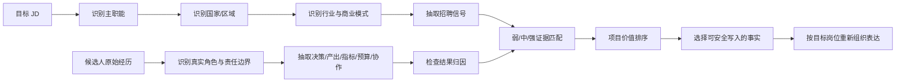

> **本文件是「品牌 + GTM」岗位增强规范的【依据层】。** 它承载市场调研事实、证据词典、能力矩阵、指标证明力、企业/通道/英文岗差异与通用写作透镜，**按需读取**。
> 判定、选证据、改写、真实性校验的操作规则在配套执行层 `brand-gtm-执行规范.md`（全文必读）。
> 冲突裁决顺序：候选人真实事实 > 目标 JD > 执行层规则 > 依据层结论 > 通用写作常识。
> 2026-09-26 拆分说明：原 `deep-research-report-品牌.md` 的市场调研部分归入本文件；其“Resume Skill 可执行规则”已重构为执行层。

# 中国大陆品牌营销、出海营销、产品营销与 GTM 岗位事实及简历证据规范

## 执行摘要与研究设计

基于本轮检索的 64 个 2025–2026 岗位记录，核心结论是：**“海外”主要是市场场景，不是独立职能；岗位价值应按工作对象、决策权、产出与 KPI 判断。简历证据的核心不是“策略、主导、英文流利”等词，而是实际决策、责任边界、完整闭环、指标和可归因结果。**

本报告以附件中的实际研究任务为准：服务对象不是普通求职者，而是下游 Resume Generation Skill；研究目标是把中国大陆企业真实招聘事实转换为机器可执行的“**岗位事实 → 招聘信号 → 候选人证据**”规则。fileciteturn0file0

**[研究范围]** 本轮共纳入 64 个近期岗位记录，其中 60 个属于品牌、内容、数字增长、产品营销/GTM、海外/区域市场等目标岗位，另保留 4 个产品、销售、商业化相邻岗位用于边界验证。岗位集中在 2025–2026 年；腾讯在 2026 年仍公开出现海外品牌营销、区域发行、海外传播、投放与商业化等明显不同的岗位，小鹏 2026 年同一招聘批次也同时出现海外区域品牌营销、海外产品营销、海外整合营销、海外公关、海外媒介投放等职位，这本身就是“海外不是单一职能”的直接证据。citeturn9search9turn9search13turn9search16turn15search13

需要说明一个重要限制：**64 个是“真实岗位记录”，不等于 64 个都能读取完整 JD。**部分公司招聘官网采用动态页面，部分校招/社招批次只公开职位名，部分已下线岗位只能通过高校就业网、招聘公众号镜像或第三方职位页恢复。因此，本报告只用能读取到完整或近完整职责的岗位判断“能力强度、Required/Preferred、Ownership”；只有岗位名的记录只用于确认岗位存在和分类，避免把标题级信息虚构成公司要求。华为招聘官网也明确提醒其官网/官方招聘公众号才是应以之为准的渠道，这进一步说明来源分级的必要性。citeturn14search14

| 研究要素 | 本报告处理方式 |
|---|---|
| 基本分析单位 | 单个真实岗位，而不是公司品牌或营销理论 |
| 一级分类 | 主职能 |
| 二级分类 | 是否出海、国家/区域 |
| 三级分类 | 商业模式、行业 |
| 核心编码字段 | 工作对象、核心决策、产出、KPI、Required、Preferred、数据/渠道/商业/语言要求、Ownership |
| 来源优先级 | 公司官网/官方招聘 ＞ 官方内容转载/高校就业网 ＞ 招聘平台/职位镜像 |
| 事实等级 | **事实 / 研究归纳 / 推论 / 证据不足** |
| Title 的作用 | 仅作检索线索；不能单独决定岗位分类 |
| 批次岗位 | 可证明“这个岗位存在”；不能据此推断具体能力要求 |
| 第三方 JD | 作为补充；不写成“公司官方明确要求” |
| 简历转换原则 | 先验证事实，再判断证据强度，最后决定是否写入 |

本研究最终建议下游 Skill 采用以下工作流，而不是“看到关键词就匹配关键词”：

这一流程尤其重要，因为公开 JD 显示，同一家企业内部“海外品牌营销”“海外投放”“海外产品营销”“海外渠道/销售”的工作对象和 KPI 可以完全不同。例如石头科技的招聘序列会分开出现海外市场营销、海外渠道、Amazon 运营、官网运营及广告投放；OPPO 的海外岗位也分别出现社媒、媒介、产品营销与数字营销，而非统一成一个“海外营销岗”。citeturn4search9turn2search1

## 岗位分类体系与岗位画像

**[研究归纳] 最可靠的分类公式不是“职位名称”，而是：**

> **岗位类型 = 工作对象 + 核心决策 + 核心产出 + KPI**  
> 再叠加：**国家/区域 × 商业模式 × 行业 × 职级/责任深度**

### 主职能的事实分类

| 主职能 | 工作对象 | 核心决策 | 主要产出 | 典型 KPI/结果 | 一句话判断 |
|---|---|---|---|---|---|
| 品牌与整合营销 | 消费者认知、品牌意义、产品/品牌传播 | 面向谁、说什么、以什么创意主题和媒体组合传播 | 品牌策略、Campaign、传播主题、整合营销方案 | 品牌提升、品牌搜索、声量、活动/上市效果及业务贡献 | **管理市场如何理解品牌/产品** |
| 内容/社媒/达人 | 内容供给、平台账号、创作者网络、社区 | 内容支柱、平台打法、创作者组合、Brief、分发机制 | 内容计划、账号矩阵、达人项目、社区运营 | 播放、互动、完播、分享、粉丝、内容转化 | **管理什么内容通过谁在什么平台触达用户** |
| 数字增长/投放/电商营销 | 流量、漏斗、订单、用户增长 | 渠道、预算、受众、素材、出价、落地页、转化路径 | 投放计划、增长实验、电商活动、归因与优化方案 | CTR、CVR、CPA/CAC、ROAS、LTV、GMV、Revenue | **管理可测量的获客与转化效率** |
| 产品营销/GTM | 产品与市场之间的商业化过程 | 市场机会、卖点、定位、定价、上市节奏、渠道、销售打法；具体范围因行业而异 | GTM 方案、上市方案、产品营销包、销售赋能/渠道方案 | 上市表现、销售、采用、渠道表现、收入、利润、库存等 | **管理产品怎样成功进入市场并形成商业结果** |
| 国家/区域市场操盘 | 一个国家/区域的综合市场业务 | 当地用户、产品组合、品牌、渠道、预算、本地化以及部分销售杠杆 | 国家/区域市场计划及跨职能执行 | 销售、市场份额、渠道覆盖、新品表现、区域增长 | **管理某个地理市场，而不是单一营销渠道** |

这一分类由当前岗位的实际职责支持。腾讯海外品牌岗位强调全球上市、品牌定位、核心卖点、Campaign、内容/KOL/媒体；腾讯 Workbuddy 海外投放岗位则直接围绕渠道策略、预算、CPI/CPA/ROAS、留存/LTV；小米手机 GTM 则把产品、商务、营销、渠道、零售、交付、服务、控货控价和生命周期纳入一个上市闭环。三者虽然都可以带“海外”，本质上是三种不同工作。citeturn9search9turn9search16turn14search9

### 相邻岗位边界

| 容易混淆的岗位 | 真正的区分条件 |
|---|---|
| 品牌营销 vs 内容营销 | 品牌营销决定**定位、核心信息、Campaign 与整合资源**；内容岗通常决定**内容体系、平台和创作者执行方式**。做很多内容不等于拥有品牌定位权。 |
| 品牌营销 vs 数字增长 | 品牌岗优化认知与品牌/产品传播；增长岗优化获客、漏斗和投资效率。高 ROAS 本身不能证明品牌策略。 |
| 海外品牌 vs 海外投放 | 前者的核心对象是品牌/产品在当地市场的认知与整合传播；后者核心对象是付费流量及转化。 |
| 海外市场经理 vs 海外运营 | 市场岗若拥有市场判断、营销策略和资源配置权，深度高于单纯流程/账号/活动运营；但“运营”标题也可能很宽，必须回到职责。 |
| 海外市场经理 vs 海外销售 | 销售的第一责任通常是客户、渠道、订单、回款/销售额；市场负责需求、传播和市场形成。两者在区域岗位可能重叠，不能仅按“市场”二字判断。 |
| 产品营销 vs 产品经理 | 产品经理更直接决定产品定义、需求和研发路线；产品营销更直接决定市场定位、价值表达、上市及商业采用。但中国硬件企业中两者可能明显交叉。 |
| GTM vs 产品营销 | **不能固定等号，也不能固定拆开。**部分企业把 GTM 做成产品营销核心环节；部分硬件企业则包含价格、渠道、供应、库存及经营结果。 |
| GTM vs 销售运营 | 销售运营通常围绕销售流程、政策、预测、CRM 和效率；GTM 若成立，应包含市场进入/产品上市的实质决策，而非只维护销售流程。 |
| GTM vs 国家市场操盘 | GTM 更常围绕产品/品类如何上市和经营；国家市场围绕整个地理市场，可能同时管理多个产品和渠道。 |
| 跨境电商运营 vs 海外营销 | Amazon/独立站日常运营、listing、促销和店铺数据属于电商运营；只有当职责扩大到市场洞察、用户获取、品牌/内容或跨渠道市场决策时，才适合归入更宽的海外营销。 |

例如小红书“商业化跨境业务大客户销售”会为海外客户提供品牌、效果和整合营销解决方案，但岗位本身仍有客户开发、销售策略和销售目标，因此不能因为“懂营销方案”就归为品牌营销；EcoFlow 的加拿大海外销售岗位同样以经销商/零售渠道、订单和客户关系为核心，品牌推广只是与营销团队协同。citeturn9search7turn3search11

中国企业的 GTM 尤其不能直接套美国 SaaS PMM 模板。小米手机 GTM 要求上市全盘、生命周期、量价/价格与发货管理；安克 GTM 岗把市场、竞争、渠道、定价、品牌、销售政策、库存与营销费用纳入区域经营；DJI 当前海外 GTM 更直接写到 sell-out、价格体系、促销、陈列、导购培训、预测和库存周转。citeturn14search9turn11search2turn14search6

### 各岗位的典型工作闭环

| 岗位 | 典型闭环 |
|---|---|
| 品牌/整合 | 消费者与竞品洞察 → 人群/定位/信息 → Campaign/创意策略 → 媒体/PR/社媒/达人整合 → 上线执行 → 品牌与业务效果复盘 |
| 内容/社媒/达人 | 用户与平台洞察 → 内容支柱/平台策略 → 选题/Brief/达人组合 → 制作和分发 → 社区互动 → 内容数据 → 迭代内容模型 |
| 数字增长 | 用户/漏斗诊断 → 渠道与受众假设 → 预算和素材测试 → 投放/落地页 → 转化/归因 → CAC/ROAS/LTV 分析 → 扩量或停止 |
| 产品营销/GTM | 市场/用户/竞品 → 产品价值和机会判断 → 定位/卖点/价格/渠道/上市方案 → 跨产品销售营销供应链落地 → 上市 → 销售/采用/库存等复盘 → 生命周期优化 |
| 国家/区域市场 | 当地市场与消费者 → 市场优先级 → 产品/品牌/渠道/本地化组合 → 本地团队及总部协同 → 新品/活动/销售执行 → 区域经营数据 → 资源重配 |

腾讯《王者荣耀世界》海外市场岗位明确要求从市场/玩家洞察进入产品周期营销，再协调产品、运营、效果广告、社区等团队；另一个二次元海外市场岗位甚至覆盖测试、预约、上线、版本更新以及广告、社媒、内容、KOL/Vtuber、线下和社区，说明成熟游戏海外营销常是一条产品生命周期传播闭环，而非单纯“发海外社媒”。citeturn9search12turn9search18

## 研究模块的综合发现

下表把原研究任务中的各模块压缩成可供 Skill 消费的事实层。重要的是：**招聘信息写的是“公司想让这个岗位做什么”，不是候选人做过什么；Resume Skill 仍需对候选人经历进行独立验证。**

| 研究主题 | 核心发现 | Resume Skill 应如何使用 |
|---|---|---|
| 岗位分类与边界 | “海外”是第二维度；主职能仍可能是品牌、内容、效果、电商、GTM、区域经营 | 不建立统一 `overseas_marketing` 能力标签；先判主职能 |
| 工作流程 | 高阶岗位通常要求“洞察→判断→策略→资源→执行→结果→复盘”，初级岗位更多从执行环节切入 | 判断候选人覆盖了闭环的哪几段 |
| 能力模型 | 相同能力在不同岗位权重差异很大 | 使用岗位专属权重，而不是营销通用关键词表 |
| 执行到策略 | 策略的本质是**做出有约束条件的决策**，而不是写“策略”二字 | 必须寻找“依据什么、决定什么、舍弃什么、资源怎样配置” |
| 出海能力 | 语言只是基础设施；当地用户、渠道、文化、平台、竞争和产品/内容本地化才形成海外业务证据 | 英语、留学不得直接触发“海外营销强” |
| 项目证据 | 项目名气不如个人责任边界、决策和结果重要 | 大 Campaign 中“参与”可弱于小项目的完整 Ownership |
| 指标 | 不同指标证明不同环节；曝光、互动、ROAS、Revenue 不能互相替代 | 先识别指标的因果距离，再决定表达强度 |
| 招聘信号→证据 | 单个动词和标签证据很弱；决策+执行+量化+责任边界形成强证据 | 对每个信号建立弱/中/强三级证据 |
| 背景迁移 | 可迁移的是能力事实，不是原职位名 | Agency、内容、电商、销售等背景均需找目标岗位实际能力交集 |
| 行业差异 | 同叫 GTM/海外市场，在硬件、游戏、电商、B2B SaaS/AI 中工作对象可明显不同 | GTM 匹配前强制识别 business model |

这些结论并非营销教科书推演。例如安克全球广告岗位直接以 Meta、Google、X、TikTok、Amazon 等平台、CTR/CVR/ROI 和渠道测试为工作对象；其 GTM 产品岗位却涉及 4P/区域经营、库存及营销费用。腾讯海外品牌和投放岗位的分化也呈现同一规律。citeturn11search4turn11search2turn9search9turn9search16

### 岗位 × 能力矩阵

以下是**[研究归纳]**，强度含义为：**核心**=通常决定岗位是否成立；**高频**=大量相关岗位出现；**加分**=取决于公司/行业；**低**=一般不是该岗位的主要证明对象。该归纳主要根据腾讯、小米、安克、阿里云、Insta360 等可读取职责的岗位交叉编码。citeturn9search9turn14search9turn11search2turn6search1turn3search10

| 能力 | 品牌/整合 | 内容/社媒/达人 | 数字增长/电商 | 产品营销/GTM | 国家/区域 |
|---|---|---|---|---|---|
| 消费者/用户洞察 | 核心 | 高频 | 高频 | 核心 | 核心 |
| 市场/竞品洞察 | 高频 | 加分 | 高频 | 核心 | 核心 |
| 品牌定位 | 核心 | 高频 | 低 | 高频* | 高频 |
| 产品卖点提炼 | 高频 | 高频 | 加分 | 核心 | 高频 |
| 创意判断 | 核心 | 核心 | 高频 | 高频 | 高频 |
| 内容策略 | 高频 | 核心 | 高频 | 加分 | 高频 |
| 社媒策略 | 高频 | 核心 | 高频 | 加分 | 高频 |
| 达人策略 | 高频 | 核心 | 高频 | 加分 | 高频 |
| 整合营销 | 核心 | 加分 | 加分 | 高频 | 核心 |
| 投放/效果营销 | 加分 | 加分 | 核心 | 加分 | 高频 |
| 转化/归因 | 加分 | 高频 | 核心 | 高频 | 高频 |
| 电商 | 加分 | 加分 | 核心* | 高频* | 高频* |
| 渠道/零售 | 加分 | 低 | 高频* | 核心* | 核心 |
| 定价 | 低 | 低 | 加分 | 核心* | 高频 |
| 生命周期管理 | 低 | 低 | 加分 | 核心* | 高频 |
| 新品上市 | 高频 | 高频 | 高频 | 核心 | 核心 |
| 销售赋能 | 低 | 低 | 低 | 核心* | 高频* |
| 数据分析 | 高频 | 高频 | 核心 | 核心 | 核心 |
| 项目管理 | 核心 | 高频 | 高频 | 核心 | 核心 |
| 跨团队推进 | 核心 | 高频 | 高频 | 核心 | 核心 |
| 商业意识 | 高频 | 加分 | 核心 | 核心 | 核心 |
| 经营结果责任 | 加分 | 低/加分 | 核心 | 核心* | 核心 |

“*”代表行业依赖明显。例如硬件 GTM 的渠道、价格、库存和生命周期权重远高于许多互联网内容型产品；B2B SaaS 的销售赋能/客户采用又可能远高于消费品牌。小米、DJI、安克的硬件 GTM JD 都支持前一种模式。citeturn14search9turn14search6turn11search2

阿里云海外用户运营与市场营销则显示另一种形态：重点是云与 AI 用户增长、海外用户洞察、技术社区、营销活动、生态合作及与产品/研发/法务等团队协作；一个早期 AI/B2B SaaS GTM 实习岗位则进一步把 ICP 研究、客户数据丰富、外联和 CRM 纳入 GTM。**因此“B2B/AI GTM”内部本身也高度分化，本轮证据不足以把它统一定义成某一种美国式 PMM。**citeturn6search1turn6search15

## 能力深度、招聘信号与指标证据

### 营销能力深度模型

这是整份规范中最适合直接写进 Resume Skill 的部分。

| 深度 | 可观察事实 | 可以怎样判断 | 不足以升级的情况 |
|---|---|---|---|
| L0 参与/支持 | 协助、整理、跟进、制作、会议支持 | 知道项目，但没有自己的独立责任单元 | “参与了某大型 Campaign” |
| L1 独立执行 | 独立完成一项明确任务/内容/活动/投放操作 | 有独立交付物，但核心策略由别人决定 | 独立发帖 ≠ 社媒策略 |
| L2 模块负责人 | 对一个渠道、达人池、内容模块、投放账户等负责 | 有范围、资源和模块指标 | 只有“对接”但无选择权/指标 |
| L3 策略并落地 | 基于洞察做出策略选择，并亲自推动执行 | 能说明为什么这么做、资源如何配置、结果如何 | 简历仅出现“制定策略”四字 |
| L4 端到端结果负责人 | 完整负责 Campaign、上市或市场项目 | 策略、预算/资源、跨团队、执行、指标和复盘均有证据 | 只负责其中某一环，却写“整体操盘” |
| L5 品牌/产品/国家经营负责人 | 对产品/品类/国家的多杠杆商业结果负责 | 价格、渠道、库存、销售、利润/份额、产品组合等多个经营杠杆有真实决策权 | 仅有营销 KPI 却自称“经营负责人” |

这并非单纯按年资划分。安克的 GTM 实习岗位主要是销售记录、库存、促销、数据整理和海外项目支持，适合 L0–L1 证据；其 GTM 市场产品经理则要求对区域经营结果、市场策略、跨职能、库存和营销投入承担更深责任；DJI 海外 GTM 更明确写到“不是支持岗”、端到端 GTM、sell-out、价格、促销、陈列、预测及库存。这些岗位构成了较清晰的责任深度梯度。citeturn11search5turn11search2turn14search6

**[Resume Skill 规则] “策略能力”至少应同时满足三个条件：**

**决策对象存在**：候选人确实决定过人群、定位、信息、渠道、内容框架、达人组合、预算、价格或上市方案中的一个重要要素；  
**决策依据存在**：有用户、市场、数据、竞品、实验或商业约束作为依据；  
**策略进入执行**：不是只交方案，而是能追踪其实施和结果。

因此，“参与消费者调研后写过方案”至多是中等证据；“发现目标客群认知障碍 → 重定义核心卖点 → 调整 KOL/内容和媒体组合 → 上线后有可验证变化”才更接近强证据。

### 招聘信号 → 弱/中/强证据矩阵

| 招聘信号 | 弱证据 | 中等证据 | 强证据 | 常见误判 |
|---|---|---|---|---|
| 消费者洞察 | 看过报告、整理评论 | 独立访谈/调研并形成结论 | 洞察直接改变定位、产品或营销决策并验证 | “做过用户研究”不等于洞察被采用 |
| 市场洞察 | 收集竞品资料 | 建立市场/竞品分析 | 判断机会、优先级并影响资源配置 | 信息搜集 ≠ 战略判断 |
| 品牌策略 | 执行品牌 Campaign | 参与定位/信息讨论 | 定义人群、定位、品牌核心信息并推动整合落地 | Campaign 执行 ≠ 品牌策略 |
| 品牌定位 | 使用现有定位写内容 | 参与定位研究 | 基于消费者和竞品形成/重构定位并验证 | 写 slogan ≠ 定位 |
| 创意判断 | 制作素材 | 能产 Brief、筛选创意 | 将用户洞察转成创意原则，并基于效果迭代 | “审过稿”不是创意策略 |
| 内容策略 | 写过文章/视频 | 负责栏目/内容日历 | 定义内容支柱、受众、平台分工、分发和评估机制 | 会写内容 ≠ 内容策略 |
| 社媒策略 | 发帖 | 独立运营一个账号 | 设计平台角色、增长机制、内容模型及指标体系 | 粉丝增长不自动等于策略能力 |
| 达人策略 | 联系 KOL | 独立筛选/谈判/执行一批达人 | 按人群/平台/漏斗设计达人组合、Brief、预算和评估机制 | “对接过百位 KOL”仍可能只是执行 |
| 整合营销 | 做过其中一个模块 | 负责两个以上模块协同 | 统一主题下分配媒体、PR、内容、达人、活动并负责结果 | 多渠道出现 ≠ 真正整合 |
| 数字营销 | 看过广告数据 | 独立账户/渠道优化 | 预算分配、实验设计、归因、CAC/ROAS/LTV 联动优化 | “投过 Meta”不等于增长能力 |
| 数据驱动 | 会 Excel/BI | 根据数据做优化 | 建立判断框架、实验和归因并改变资源配置 | 工具技能 ≠ 数据决策 |
| 海外市场经验 | 英语流利、留学 | 执行过海外项目 | 对具体国家/区域的用户、渠道、本地化及结果有责任 | 留学 ≠ 市场经验 |
| 本地化 | 翻译文案 | 调整语言/素材 | 基于当地文化、平台、渠道和行为改变产品/营销方案 | 翻译 ≠ 本地化 |
| 新市场进入 | 做过市场资料 | 支持某国家 launch | 评估市场→选择进入方式→资源部署→上市→结果复盘 | “上线某国家”不自动等于市场进入 |
| 国家/区域操盘 | 配合当地团队 | 独立负责当地某模块 | 对国家市场策略、预算、渠道/产品/上市及 KPI 有综合责任 | 常驻海外 ≠ Country Ownership |
| 产品卖点提炼 | 改写产品文案 | 基于功能形成卖点 | 结合用户需求、竞品和产品能力定义价值主张并验证 | 文案包装 ≠ 产品营销 |
| 产品营销 | 做物料/发布会 | 负责某一上市模块 | 洞察→定位/卖点→上市→跨团队→市场结果 | 参加发布会 ≠ PMM |
| GTM | 支持 launch | 负责时间表/单一模块 | 对市场进入策略及多个商业杠杆承担端到端责任 | “参与新品上市” ≠ GTM |
| 新品上市 | 活动执行 | 独立负责一个上市工作流 | 上市策略、节奏、资源、跨团队、渠道/营销和结果 | 发布会 ≠ 上市 Ownership |
| 销售赋能 | 做 PPT | 制作销售工具/培训 | 基于客户异议与竞争设计销售打法并影响 win/adoption | 营销物料 ≠ Enablement |
| 跨团队推进 | 参加会议 | 项目协调 | 有目标、依赖、冲突处理和按时交付结果 | “协同多个团队”无具体行动，证据弱 |
| 代理商管理 | 对接供应商 | 管理交付 | 选型、Brief、预算、质量、绩效、续约/淘汰全链路 | 微信沟通 ≠ Vendor Management |
| 商业结果 | 项目期间销售上涨 | 结果与项目相关 | 明确自己控制的杠杆、基准和增量，归因边界合理 | Revenue 同比增长 ≠ 全部由营销造成 |
| 结果责任 | 有 KPI | 自己承担模块 KPI | 有实际决策权，同时承担结果偏差和复盘责任 | “关注指标” ≠ 对指标负责 |
| 规模化 | 做过一次成功项目 | 多次重复 | 建立机制/模板/系统，使打法跨国家、产品或团队复制 | 项目规模大 ≠ 有规模化能力 |

当前招聘信息提供了大量反例。Insta360 海外营销实习岗包含内容创意、达人沟通和海外社媒矩阵，但其职位层级和职责仍主要是执行/协助，因此不应自动推断为“拥有海外社媒战略”；宝时得社媒岗位亦大量围绕日常平台运营、内容、KOL/KOC 支持和复盘。相反，腾讯成熟海外营销岗位直接要求完整产品周期市场策略及可追踪结果，两者证据等级明显不同。citeturn3search10turn12search0turn9search12

### 指标 → 能证明什么 → 不能证明什么

**[研究归纳 + 分析判断]** 当前数字增长岗位会明确以 CPI、CPA、ROAS、留存、LTV、CTR/CVR 等作为优化对象，而品牌岗位会同时谈品牌声量、Campaign 效果及业务影响；这意味着不同指标在招聘中对应不同的能力环节，不能只按“数字越大越好”处理。citeturn9search16turn11search4turn15search15

| 指标 | 更能证明 | 不能自动证明 | 简历最佳用法 |
|---|---|---|---|
| 曝光/Impressions | 传播覆盖规模 | 品牌认知、偏好或销售提升 | 与目标受众、成本、增量或后续指标组合 |
| 媒体曝光/声量 | PR/传播存在感 | 消费者真实认知改变 | 补充高质量媒体、SOV、搜索或 Brand Lift |
| 品牌搜索 | 主动兴趣变化 | 一定是营销单独造成 | 给出时间窗口、基准和活动关联 |
| Brand Lift | 广告/营销对认知指标的较直接影响 | 长期品牌资产、销售利润 | 说明研究设计、指标与增量 |
| 播放/阅读 | 内容被消费 | 内容说服力或品牌价值 | 补完播、互动、分享、转化 |
| 互动率 | 内容引发反应 | 商业结果 | 与受众质量、平台基准结合 |
| 完播率 | 内容留存/叙事效果 | 用户购买意愿 | 适合证明内容优化 |
| 分享/收藏 | 内容实用性或传播意愿 | 最终购买 | 与内容类别及后续流量关联 |
| 粉丝增长 | 账号资产增加 | 新增粉丝质量、收入 | 补自然/付费来源和活跃质量 |
| CTR | 创意/受众与点击意愿 | 落地页转化、收入 | 结合 CVR/CPA |
| CVR | 某一漏斗阶段的转化效率 | 整体获客经济性 | 写清分母和转化定义 |
| CPA | 某目标行为的获客成本 | 客户长期价值 | 与 LTV/留存组合 |
| CAC | 获得客户的成本效率 | 盈利质量 | 说明获客口径与贡献毛利 |
| ROAS | 广告收入/广告投入效率 | 总营销 ROI、利润、品牌效果 | 限定为付费媒体范围 |
| LTV | 用户长期价值 | 获客渠道本身优秀 | 与 CAC、分群、留存结合 |
| GMV | 交易规模 | 收入、利润，更不能自动归因个人 | 加渠道、基准、营销可控范围 |
| Revenue | 营收结果 | 候选人独立贡献 | 说明候选人控制的杠杆及增量口径 |
| Orders | 订单数量 | 客单价、利润、用户质量 | 与 AOV、复购、转化组合 |
| 市占率 | 相对竞争地位 | 单一 Campaign 因果 | 更适合区域/GTM长期经营证据 |
| 渠道覆盖 | 市场可获得性 | sell-out 或渠道效率 | 补活跃网点、单店产出 |
| 新品销售 | 上市商业表现 | 全由营销造成 | 与库存、价格、渠道和产品因素拆开 |
| 库存周转 | 供需/渠道经营效率 | 品牌能力 | 硬件 GTM/经营岗价值高 |
| 利润/毛利 | 商业质量 | 一定由市场团队独立决定 | 只有真实参与价格/渠道/费用等杠杆时使用 |

因此，应禁止下游 Skill 做这些推断：

> **曝光高 → 品牌认知提升**：不成立。  
> **互动高 → 品牌策略成功**：不成立。  
> **ROAS 高 → 品牌能力强**：不成立。  
> **GMV 增长 → 候选人贡献了全部增量**：不成立。  
> **Revenue 增长 → GTM 成功且由营销负责**：没有责任边界和归因证据时不成立。

## 中国企业出海专项与行业差异

### “海外经验”的招聘事实

**英语的价值首先是工作门槛和协作工具，而不是营销能力本身。**大华海外市场产品岗位要求英语可作为工作语言并接受海外出差/常驻；Anker 多个 GTM 岗同样要求英语工作能力；Insta360 的海外营销岗位也要求能使用英语处理工作。但这些 JD 同时要求市场、产品、内容、数据或渠道能力，因此不能把语言能力单独升级成“海外营销能力”。citeturn13search1turn11search7turn3search10

**小语种的招聘价值具有场景性。**OPPO 直接设置面向西语/葡语市场的海外社媒、产品营销、数字营销岗位；Anker 有俄语 GTM；大华也把小语种作为海外市场产品岗位的加分条件。这说明小语种在特定国家内容、客户/渠道沟通和本地化岗位中可能显著增值，但仍不能替代职能能力。citeturn2search1turn11search7turn13search1

**留学经历通常是辅助信号，而不是能力结论。**阿里云相关海外用户/市场岗位把海外学习或实习、理解欧美用户与生态等列为加分条件之一，而不是用海外学历代替用户增长、市场洞察或跨团队能力；小鹏海外产品培训生也把海外生活/学历经历写为“优先”，同时真正职责集中在目标国家的客户、文化、政策和竞品研究。citeturn6search1turn15search1

据此，可以直接回答研究任务中的几个关键问题：

| 问题 | 研究结论 |
|---|---|
| 英语是什么级别的信号？ | **门槛/工作能力信号。**能证明跨语言工作可行性，不能独立证明海外市场判断。 |
| 小语种什么时候重要？ | 国家定向的社媒、内容、GTM、区域市场、客户/渠道岗位中更重要；泛全球岗位可能仅为加分。 |
| 留学经历本身价值多大？ | 弱到中等背景信号；只有转化为真实用户/市场理解或工作结果才增强。 |
| 海外工作经历本身价值多大？ | 高于纯留学，但仍应判断候选人到底做营销、销售、运营还是支持工作。 |
| 没海外生活但实际负责海外市场是否能形成强证据？ | **可以，而且可能比留学更强。**关键是实际市场责任、当地决策和结果。 |
| 什么是真正的海外市场经验？ | 对明确国家/区域真实工作，理解并影响当地用户、竞争、渠道、内容/产品本地化或商业结果。 |
| 什么只是海外业务执行？ | 按既定策略翻译、发帖、对接达人、整理资料、执行总部方案，而无实质市场判断权。 |

### 行业与商业模式并不共享一个 GTM

| 商业模式 | GTM/海外市场更可能关注 | 样本中的典型证据 | Resume Skill 必须寻找 |
|---|---|---|---|
| 消费电子/智能硬件 | 市场机会、产品组合、4P、价格、渠道、零售、上市、供货/库存、生命周期 | 小米、安克、DJI、EcoFlow | 是否拥有价格/渠道/上市/库存等实质商业杠杆 |
| 游戏/内容产品 | 玩家洞察、预约/测试/上线、内容、KOL、社区、PR、买量、版本周期 | 腾讯、4399 | 是否覆盖产品生命周期和特定区域，而非单次推广 |
| 跨境电商/DTC | 流量、转化、平台、促销、广告、GMV/Revenue，同时部分品牌会强化内容和品牌 | Anker 海外电商、石头 Amazon/广告/官网岗位 | 区分“店铺经营”和“品牌市场”；关注利润/复购而非只 GMV |
| App/工具 | 用户获取、付费投放、素材、本地化、留存/LTV；品牌型产品再加入内容/社区 | 腾讯 Workbuddy、CapCut | CAC/ROAS/LTV 与用户/内容策略分别验证 |
| B2B SaaS/Cloud | 客户/用户洞察、技术内容/社区、采用、生态、销售协同；早期企业可能大量包含 ICP/outbound | 阿里云、软通动力、Metix AI | 看销售模式；不能看到“GTM”就套用品牌上市模板 |
| AI 消费产品 | 产品教育、新场景定义、用户增长、内容、社区，部分硬件还与产品定义强耦合 | 阿里 AI、INMO | 区分 PM、PMM、增长与 GTM 的真实责任 |
| 国家/区域经营 | 产品、价格、销售、渠道、品牌、营销、本地化等组合，依公司授权不同 | 海外区域 GTM、国家经理、区域市场岗位 | 是否真正有国家层面的资源和 KPI 权限 |

**消费电子 GTM 的第一个假设得到较强支持。**小米手机 GTM 直接包括产品上市、产品/商务/营销/渠道/零售/交付/服务、卖点、生命周期以及价格/发货管理；DJI 的当前海外 GTM 进一步覆盖线下价格、促销、陈列、培训、预测和库存；EcoFlow 北美家储 GTM 同样涉及区域 4P、库存、销售、生产物流、渠道组合与整合营销。可以把“新品商业化 + 渠道/价格 + 生命周期/经营”视为中国消费电子 GTM 的高概率模式，但不能规定所有公司完全一致。citeturn14search9turn14search6turn3search8

**B2B SaaS/AI GTM 的第二个假设只得到“明显分化”的支持，而不是统一答案。**阿里云样本偏海外用户洞察、技术社区、增长和生态；软通动力 SaaS 国际增长岗位偏多渠道获客、技术内容和增长分析；早期 AI SaaS 岗位则明显靠近 ICP、外联和 CRM。当前样本不足以证明“中国 B2B GTM 一般必然以 Pipeline/销售赋能为核心”，下游 Skill 必须先读目标 JD。citeturn6search1turn11search13turn6search15

**跨境电商的确更直接连接 GMV、转化和平台经营，但“跨境电商 = 海外营销”仍然不成立。**Anker 的海外电商业务岗对平台销售结果、定价、促销和广告优化负责；石头则把海外市场、海外渠道、Amazon、官网和广告投放分成不同岗位，恰好证明这些能力可以关联，但不是同义词。citeturn11search0turn4search9

**品牌型消费品/家电的海外岗位更容易出现品牌、内容、PR、Creator 与线下整合。**当前一个家电海外品牌经理岗位明确要求重点国家的线上 Google/Meta/TikTok 与线下全渠道、品牌资产、Campaign、本地团队协作和预算管理；小鹏的 2026 招聘也把海外区域品牌、整合营销、公关、KOC 和媒介投放拆成专门岗位。citeturn15search15turn15search13

**国家/区域岗“可能接近小型经营负责人”，但绝不能一概而论。**例如 AliExpress 当前“AI 国家经理”职责覆盖选品、定价、增长、营销、翻译、履约等端到端国家经营环节；而中信科“海外市场经理”又明显同时包含市场洞察、推广和销售计划/客户关系；还有很多“海外市场”其实本质更接近销售。故只有 JD 明确存在产品、价格、渠道、预算、销量等经营杠杆时，才能提升到经营责任。citeturn14search0turn14search1turn15search10

## 企业类型对比与逐公司信号结论

> 本节为 2026-09-25 补充检索后新增（补 A、补 B）。原 64 条样本虽覆盖多类企业，但未做“企业类型”维度的系统对照。下文按雇主性质把目标岗位分成四类，并给出高频雇主的逐公司信号结论。

### 大厂 / 出海标杆 / 外企 / 央企国企 的本质差异（补 B）

**[研究归纳]** 结合 2026-09-25 补充检索，四类雇主在“证据偏好、责任深度、语言门槛、培养方式”上明显不同：

| 企业类型 | 典型雇主 | 岗位形态 | 招聘证据偏好 | 责任深度信号 | 语言/文化门槛 | 培养方式 |
|---|---|---|---|---|---|---|
| 互联网/平台大厂出海 | 腾讯、字节、阿里国际、美团、快手、拼多多 Temu | 海外品牌/投放/增长/区域发行，职能切得细 | 体系化、分职能、重数据/平台生态认知 | 单职能深挖，L2–L4；端到端较少 | 英语工作语言；本地化平台认知 | 出海营销学院 / Global Marketing Academy 内训 |
| 消费电子/硬件出海标杆 | 安克、小米、华为、DJI、EcoFlow、石头、Insta360 | 海外品牌、GTM、区域经营、电商 | 结果导向 + 本地洞察；从“语言+学历”转向“结果+本地洞察” | 硬件 GTM 可到 L4–L5（价格/渠道/库存/生命周期） | 英语 + 小语种场景化；本地消费者行为洞察 | 海外轮岗计划、本地雇员配比考核 |
| 传统外企/快消/德企 | 宝洁、联合利华、欧莱雅、汉高、玛氏、强生、施耐德 | 品牌管理（小 CEO）、管培、区域市场 | 综合素质/八大能力；品牌全生命周期 + P&L 意识 | 管培 = L0–L2 潜力；社招品牌经理可到 L4 | 英语硬性（雅思 7 / 托福 100）；二外加分 | 成熟管培体系（宝洁内部培养、联合利华三环） |
| 央企/国企 | 东方航空、中国电信、中化等 | 燕计划/优培生/国际化储备、经营管理、品牌营销 | 中高层管理者储备；国际化视野 + 跨文化沟通 + 轮岗 | 储备阶段看潜力与综合素质，非即时 Ownership | CET-6 为底线；英语证书可折算 | 3 年系统化轮岗（业务学习→快速培养→深度培养） |

**[事实]** 安永《2023 中国出海企业组织能力建设报告》指出 61% 受访企业已设“本地化决策授权机制”，赋予海外营销负责人预算分配、创意审批等更大自主权；Mercer《2024 全球人才流动报告》显示中国出海企业海外营销岗平均招聘周期 45 天，高于国内 32 天，主因复合型人才稀缺。【来源：大数跨境 10100.com 引用】  
**[事实]** 宝洁品牌管理岗定位为品牌“小 CEO”，负责品牌/产品线全生命周期，含消费者洞察、定位、新品上市、整合营销、渠道协同与品牌财务（P&L）。【来源：WonderCV 宝洁 2026 面经，wondercv.com/mianjing/2026-398】  
**[事实]** 东航“燕计划”培养目标为“未来中高层管理者储备力量”，3 年周期分业务学习期/快速培养期/深度培养期，优选条件含学生干部、大型活动组织、奖学金/竞赛、跨国公司实习。【来源：浙大就业网东航 2027 简章；东航招聘官网 job.ceair.com】

### 逐公司信号结论（补 A）

**[研究归纳]** 基于附录 64 条样本 + 补充检索，对高频雇主给出“应提高哪些证据权重”的结论：

- **腾讯（海外品牌/发行/投放）**：职能切得最细，单个岗位证据应聚焦“单一职能深做 + 可追踪结果”。投海外品牌岗，强证据 = 完整产品周期市场策略 + 跨团队 + 可验证结果；投投放/增长岗，强证据 = 预算/实验/归因 + CAC/ROAS/LTV 联动。不要把“海外社媒”泛化成“海外品牌策略”。
- **字节（TikTok/国际化）**：重海外社媒生态认知、英语工作语言、跨文化内容；海外整合营销/社媒/KOL/国际化品牌策划岗量大。强证据 = 本地平台打法 + 内容模型 + 数据复盘。
- **小米/华为（硬件出海）**：海外品牌/区域/GTM 偏硬件全盘——价格、渠道、零售、生命周期、上市闭环。强证据 = 对 4P/区域经营某一杠杆的真实责任。
- **安克创新（出海标杆）**：全球品牌专员岗明确要求“基于对用户/市场/竞品的理解决定品牌发展战略”，英语卓越可工作语言；校招培养含海外派遣。强证据 = 用户/市场/竞品驱动的品牌判断 + 落地 + 指标；语言是门槛不是能力本身。
- **传统外企（宝洁/汉高/联合利华）**：品牌管理/MT 看综合素质与潜力，非即战力。校招强证据 = 领导力行为（影响他人/推动落地）+ 量化商业成果 + 跨文化项目；社招品牌经理强证据 = 品牌 P&L 意识 + 整合营销 Ownership。
- **央企/国企（东航等）**：燕计划/优培生看“国际化视野 + 跨文化沟通 + 高潜力 + 综合素质”，储备期不要求即时业务 Ownership。强证据 = 大型项目统筹/跨文化协作/学生组织领导力 + 英语证书；避免把校招写成“manager 级操盘”。

### 关于“外企 vs 出海标杆”的补充判断

**[推论]** 外企（尤其快消/德企）的海外营销更多发生在“总部定义全球品牌、本地执行”的结构里，社招岗更看重品牌体系化能力与综合素质；而出海标杆企业（安克/Shein/Temu）把海外视为核心增长战场，更看重“结果导向 + 本地洞察 + 快速迭代”。二者对“海外经验”的定义不同：外企偏“跨文化协作与品牌体系”，出海企业偏“本地市场结果与增长效率”。同一段海外经历，应对不同雇主侧重不同事实。

## 校招 / 管培 / 储备人才通道的招聘信号

> 本节为 2026-09-25 补充检索后新增（补 C，高优先）。原 64 条样本已含多个校招/管培样本（OBSBOT、海信、石头、小米 GTM 实习、安克 GTM 实习、宏珏 Fashion Branding MT、大华海外市场产品管培生、其域全球营销管培生、阿里云实习等），但此前未提炼“校招/管培通道”与社招经理岗的信号差异。对候选人尤为关键：其实际投递方向（汉高 MT、东航燕计划、电信优培生、招行管培、德银 GP 等）几乎都是校招/管培/储备通道，而非社招品牌经理。

### 校招/管培 vs 社招：信号差异

| 维度 | 校招/管培/储备 | 社招品牌·GTM 经理 |
|---|---|---|
| 核心考察 | 潜力（领导力/商业敏锐/学习力/韧性）、综合素质、文化适配 | 即战力、Ownership 深度、可验证业务结果 |
| 证据强度预期 | L0–L2 可接受；看“行为证据”而非“完整 Ownership” | L3–L5；要求端到端责任与结果 |
| 语言 | 硬性门槛（外企雅思 7 / 托福 100；央企 CET-6） | 工作语言，通常“卓越可工作”而非分数门槛 |
| 轮岗/培养 | 是卖点也是要求（接受全国/全球轮岗） | 不强调，看岗位既有责任 |
| 简历重点 | 领导力行为（影响/推动/统筹）、量化成果、跨文化项目、潜质信号 | 决策权、责任边界、闭环、归因结果 |

**[研究归纳]** 快消管培（宝洁/联合利华/欧莱雅/汉高）有成熟“八大能力”评估：领导力、主人翁意识、设定高目标、解决问题、沟通说服、高效执行、团队协作、商业思维。其中领导力 = 影响他人/推动事情，不等于“当 leader”；主人翁 = 主动担责。校招简历强调用 STAR 呈现“领导行为背后的思考与成果”，而非罗列职务头衔。【来源：91bangtu.com 快消管培八大能力；网易拆解宝洁；MBA 智库 管理培训生】

**[事实]** 东航“燕计划”优选条件：在校担任学生会/社团负责人、大型校园/社会活动组织经验、国家/省/市级奖学金或竞赛荣誉、挑战杯等创业/学科竞赛校级以上荣誉、跨国公司实习经验；培养目标明确为“中高层管理者储备”“国际化视野 + 跨文化沟通”。【来源：浙大就业网东航 2027 简章；东航招聘官网】  
**[事实]** 央企/国企管培普遍要求硕士及以上、年龄 30 以内、专业不限，但优选条件重“学生干部/大型活动/奖学金/跨国公司实习”，与市场化外企差异在于更强调“抗压、组织认同、文化适配”等软性适配。【来源：东航简章；东航招聘官网】

### 校招/管培简历的证据改写规则

**[推论/规则]**
1. 校招岗不得把“参与/协助”升级为“负责/操盘”；但可用“领导行为证据”替代 Ownership 证据——例如“牵头 X 人跨文化活动、协调多国成员、推动方案落地”比“担任队长”更强。
2. 量化成果对校招同样重要：企业明确要求“拒绝‘协助策划活动’空话，需体现曝光/销量/用户转化/成本优化等数据”。即使项目小，也要给基准与增量。
3. 跨文化/海外经历在校招中是“差异化加分项”而非“能力结论”：留学/海外生活本身弱到中等；转化为真实用户/市场理解或项目结果才增强。
4. 语言成绩应作“门槛达标”事实列出（如雅思 7.0 / CET-6），不写成“海外营销能力强”。
5. 管培通道简历应突出“可塑性”信号：商业敏锐度、快速学习、轮岗适应力、抗压韧性，而非单纯堆砌实习段。

### 当前缺口说明

**[已补]** 本节已覆盖快消 MT、央企/国企管培、出海企业校招三类通道；但“银行管培（招行等）”与“纯外资 MT 区域市场岗”样本仍偏少，下游 Skill 遇到该类 JD 时应单独检索，不宜直接套用快消 MT 结论。

## 通用写作透镜：动词、标签与叙事链

> 本节写作透镜核心已上提至 `brand-gtm-执行规范.md` §9「改写措辞透镜（上提·必读）」（改写前必读）。执行层为准，本节保留完整示例与补充。

> 本节为 2026-09-25 补充检索后新增（补 D）。原文件以“硬门槛/误判/背景迁移/判定逻辑”覆盖大部分规则，但缺少独立的“有含义 vs 装饰性标签”“动词表”“叙事链模板”三项表达透镜。

### 有含义表述 vs 装饰性标签

**[研究归纳]** 品牌/营销/GTM 简历中，下列词只有在“有真实决策/结果支撑”时才算有含义，否则是装饰性标签：

| 有含义（需事实支撑） | 易沦为装饰性标签（谨慎使用） |
|---|---|
| 定位重构、整合营销、GTM 上市、区域经营、本地化方案、达人组合策略、投放优化（带指标） | 策略、主导、操盘、赋能、闭环、全域、品效合一、增长黑客 |
| 品牌 P&L、Campaign 结果、ROAS/CPA 优化 | 数据驱动、结果导向、strong sense of ownership（无实例） |
| 跨文化洞察落地 | 国际化视野、global mindset（无项目） |

规则：装饰性标签若单独出现且无事实，下游 Skill 应降级或要求补证据。

### 动词表（按证据类型）

**[研究归纳]** 按证据类型选用动词，匹配事实层级：

- 洞察与判断：识别、诊断、拆解、发现、界定、判断、定位
- 策略与决策：制定、重构、设计、取舍、配置、优先级排序
- 构建与执行：策划、搭建、落地、推行、协调、管理、运营
- 增长与结果：提升、优化、拉动、转化、降低（CAC/CPA）、扩大覆盖
- 跨团队与赋能：推动、对齐、说服、培训、赋能（需对象 + 结果）
- 复盘与迭代：复盘、归因、迭代、沉淀（机制/模板）

禁止用“负责”“主导”作为证据动词（它们是元标签，不说明做了什么）；优先用上表中的具体动作动词。

### 叙事链模板（按子族）

**[研究归纳]** 不同子族的 bullet 排序骨架：

- 品牌/整合：洞察（用户/竞品）→ 定位/核心信息 → Campaign/创意主题 → 媒体/PR/社媒/达人整合 → 上线执行 → 品牌与业务效果
- 内容/社媒/达人：平台/用户洞察 → 内容支柱/平台角色 → Brief/达人组合 → 制作分发 → 数据 → 迭代
- 数字增长：漏斗诊断 → 渠道/受众假设 → 预算/素材测试 → 转化/归因 → CAC/ROAS/LTV → 扩量或停止
- 产品营销/GTM：市场/用户/竞品 → 价值主张 → 定位/卖点/价格/渠道/上市 → 跨职能落地 → 销售/采用/库存复盘
- 国家/区域：当地市场洞察 → 产品/品牌/渠道组合 → 预算与总部协同 → 区域经营数据 → 资源重配
- 校招/管培（差异化）：领导行为/项目统筹 → 决策与落地 → 量化结果 → 跨文化/商业洞察（潜力信号）

## 研究缺口与来源附录

### 当前研究缺口

**[2026-09-25 补强状态]** 原缺失的“企业类型对比与逐公司信号结论（A/B）”“校招/管培/储备通道（C）”“通用写作透镜（D）”已于本轮补充检索后写入独立章节（见上文“企业类型对比与逐公司信号结论”“校招/管培/储备人才通道”“通用写作透镜”三节）。以下为仍待补强的真实缺口。

**国家/区域市场操盘样本仍是最大缺口。**公开职位中“海外市场经理”经常混杂销售、渠道、产品甚至客户管理；能够清晰看到国家级预算、产品组合、品牌、渠道、销售乃至利润等综合授权的完整 JD 数量，少于品牌、投放和 GTM 类岗位。因此，本报告可以确认“这类岗位可能非常接近经营负责人”，但**不能把所有 Country/Regional Marketing 默认定义成 P&L Owner**。当前 AliExpress 国家经理属于经营范围非常宽的强样本，中信科海外市场经理则明显是市场+销售拓展混合型。citeturn14search0turn14search1

**B2B SaaS 的销售赋能/Pipeline 证据需要继续扩样。**本轮中国企业样本能确认 SaaS/AI GTM 与消费硬件不同，也能观察到技术社区、用户增长、ICP/outbound/CRM 等模式，但尚不足以给“中国 SaaS GTM”定义统一 KPI。citeturn6search1turn6search15

**部分招聘网站存在内容镜像问题。**例如小米、DJI、TCL 等可从第三方职位页读取到非常完整的职责，但除非页面本身明确来自公司官方招聘系统，本报告均把它们标记为“第三方职位页/镜像”，不升级为官方原文。DJI 当前 GTM 页面和 TCL 海外产品/项目经理页面就是典型的高信息量补充来源。citeturn14search6turn14search3

**JD 只能证明招聘期望，不能证明公司内部真实权力结构。**即使 JD 写"负责""主导"，实际入职后的预算签批权、组织汇报关系和 P&L 权限仍可能不同。因此 Resume Skill 可以用 JD 定义"招聘信号"，不能据此反推某位候选人在原公司必然拥有同样权限。

**英文 CV 表达层仍缺失。**本报告「英文 / 海外岗位专属要求」第 6 节给出了英文岗位简历的概括提示，但项目级「英文简历叙事规范」（英文动词、时态、文化适配、版式约定）尚未独立成文件；候选人为德银 / 汇丰等投递过的英文 CV 经验未能沉淀为可复用规则。建议后续单独立项或在执行层 / 依据层中正式纳入。

### 核心岗位来源附录

下表为本轮编码所用的核心岗位记录。**“官网/官方”仅用于能够确认来自公司官方页面的来源；“官网标注镜像”表示聚合页明确标注原始来源为公司官网；“第三方”不视为企业官方要求。**同一招聘批次出现多个职位时拆为多个岗位记录，但若只有职位名，则只用于分类，不用于能力频次或 Required/Preferred 判断。

| 公司/组织 | 岗位 | 主要标签 | 时间 | 来源类型 / URL |
|---|---|---|---|---|
| 腾讯 | 光子发行部－海外品牌营销经理 | 品牌/整合、游戏、全球 | 2026-09 | 官网标注镜像 citeturn9search9 |
| 腾讯 | 《王者荣耀世界》海外市场营销经理 | 整合营销、游戏 | 2026-06 | 官网标注镜像 citeturn9search12 |
| 腾讯 | 二次元游戏海外市场营销经理 | 区域营销、游戏 | 2026-03 | 官网标注镜像 citeturn9search18 |
| 4399 | 海外营销策划 | 品牌/整合、游戏 | 2026 | 招聘信息页 citeturn11search8 |
| OPPO | 媒介经理（海外-西葡） | 海外媒介 | 2026-04 | 招聘批次转载 citeturn2search1 |
| OPPO | 产品营销经理（海外-西葡） | 产品营销 | 2026-04 | 招聘批次转载 citeturn2search1 |
| 字节跳动 | 海外市场推广专员 | 海外市场 | 2026 当前可见 | 官方招聘 citeturn1search3 |
| OBSBOT | 海外 PR | PR/品牌 | 2026 | 校招招聘信息 citeturn13search2turn13search13 |
| OBSBOT | 海外产品营销 | 产品营销 | 2026 | 校招招聘信息 citeturn13search2turn13search13 |
| 海信 | 市场推广 | 品牌/市场 | 2026 | 校招信息 citeturn5search5 |
| 海信 | 营销经理 | 市场/区域 | 2026 | 校招信息 citeturn5search7 |
| 海信 | 用户运营 | 用户营销 | 2026 | 校招信息 citeturn5search7 |
| 宏珏 | Fashion Branding MT | 品牌 | 2026 | 招聘批次转载 citeturn11search15 |
| Insta360 | 海外市场营销实习生 | 内容/达人/社媒 | 2026 | 第三方职位页 citeturn3search10 |
| 字节跳动 CapCut | 海外达人营销实习生 | 达人 | 2026 当前可见 | 官方招聘 citeturn1search12 |
| 字节跳动 CapCut | 海外市场产品运营实习生 | 社媒/达人/产品运营 | 2026 | 招聘平台 citeturn12search3 |
| 宝时得 | 社媒营销专员 | 海外社媒 | 2026 | 招聘信息页 citeturn12search0 |
| 万兴科技 | 海外社媒推广 | 社媒/KOL | 2026-08 | 招聘信息页 citeturn12search4 |
| 西山居 | 海外社媒运营（日本） | 社媒/日本 | 2025–26 | 招聘信息页 citeturn12search5 |
| 蓝湖 | 海外用户运营实习生 | KOL/社媒/SEO | 2025–26 | 招聘信息页 citeturn12search1 |
| 钛动 | 海外市场/KOL 运营实习 | 达人 | 2026 | 招聘信息页 citeturn12search2 |
| Makera | 海外社媒实习生 | 社媒内容 | 2026 | 招聘信息页 citeturn12search7 |
| Nativex | KOL 营销 | 达人/Agency | 2026 | 官方招聘内容镜像 citeturn11search16 |
| Nativex | 市场运营 | Agency/市场 | 2026 | 官方招聘内容镜像 citeturn9search4 |
| OPPO | 社媒运营经理（海外-西葡） | 社媒/区域 | 2026-04 | 招聘批次转载 citeturn2search1 |
| 腾讯云 | 海外传播经理 | PR/社媒/B2B | 2026-03 | 官网标注镜像 citeturn9search13 |
| OPPO | 数字营销经理（海外-西葡） | 数字营销 | 2026-04 | 招聘批次转载 citeturn2search1 |
| 腾讯 Workbuddy | 海外投放产品经理 | 效果营销/AI | 2026-08 | 官网标注镜像 citeturn9search16 |
| 腾讯 | 资深海外发行运营 | 投放/增长 | 2026-05 | 官网标注镜像 citeturn9search15 |
| 腾讯 | SLG 海外发行制作人 | 投放/增长 | 2026-03 | 官网标注镜像 citeturn9search19 |
| 腾讯 CODM | 海外商业化运营 | 商业化/区域 | 2026-08 | 官网标注镜像 citeturn9search14 |
| 安克创新 | 全球广告专员 | 效果广告 | 2026 | 招聘信息页 citeturn11search4 |
| 安克创新 | 海外电商业务经理 | 电商/区域经营 | 2026 | 招聘信息页 citeturn11search0 |
| 石头科技 | 广告投放（电商方向） | 投放/电商 | 2026 | 校招招聘信息 citeturn4search9 |
| 石头科技 | Amazon 运营 | 电商 | 2026 | 校招招聘信息 citeturn4search9 |
| 石头科技 | 官网运营 | DTC/电商 | 2026 | 校招招聘信息 citeturn4search9 |
| Nativex | 海外优化师 | 海外投放/Agency | 2026 | 官方招聘内容镜像 citeturn9search4 |
| Nativex | 海外平台媒介岗（TT/FB/GG） | 媒介/投放 | 2026 | 官方招聘内容镜像 citeturn11search16 |
| 王牌互娱 | 游戏产品海外投放 | 效果投放/游戏 | 2026 | 招聘信息页 citeturn13search0 |
| 网易雷火 | 游戏海外投放（日韩） | 游戏/投放 | 2026 | 第三方信息，低权重 citeturn13search5 |
| 小米 | 手机 GTM 经理 | GTM/硬件 | 2025-07 | 第三方 JD 镜像 citeturn14search9 |
| 小米 | 手机 GTM 部高端组 | GTM/高端手机 | 2025-07 | 第三方 JD 镜像 citeturn2search10 |
| 小米 | 全球产品行销 | GTM/产品营销 | 2025 | 招聘信息转载 citeturn2search8 |
| 小米 | GTM 产品行销专员实习 | GTM 支持 | 2026 | 招聘平台 citeturn2search5 |
| 小米 | AIoT 电商支持 GTM | GTM/电商 | 2025 | 第三方职位页 citeturn6search11 |
| 小米 POCO | GTM 高级经理 | GTM/海外手机 | 2026 当前可见 | 第三方职位页 citeturn6search17 |
| 安克创新 | GTM 市场产品经理－小语种 | GTM/区域 | 2026 | 招聘信息页 citeturn11search2 |
| 安克创新 | 市场产品专员（GTM） | GTM/经营 | 2025–26 | 招聘信息页 citeturn11search6 |
| 安克创新 | 市场产品专员（GTM）－俄语 | GTM/区域 | 2026 | 招聘信息页 citeturn11search7 |
| 安克创新 | GTM 实习生 | GTM 支持 | 2026 | 招聘信息页 citeturn11search5 |
| EcoFlow | 产品 GTM－北美家储 | GTM/北美/硬件 | 2025-08 | 第三方职位页 citeturn3search8 |
| MOVA | 海外 GTM | GTM/硬件 | 2025 | 招聘信息页 citeturn11search9 |
| 大华 | 海外市场产品管培生 | 产品市场/区域 | 2026 | 招聘信息页 citeturn13search1 |
| 阿里云 | 海外用户运营及市场营销－上海 | SaaS/Cloud/增长 | 2026 | 招聘信息页 citeturn6search1 |
| 阿里云 | 海外用户运营及市场营销－杭州 | SaaS/Cloud/增长 | 2026 | 招聘信息页 citeturn11search3 |
| 阿里巴巴 | 海外用户运营及市场营销－AI 方向 | AI/增长 | 2026 | 实习招聘信息 citeturn6search16 |
| 软通动力 | SaaS 产品国际增长营销专员 | SaaS/增长 | 2026 | 官方招聘内容镜像 citeturn11search13 |
| Metix AI/凡尔康 | GTM 实习生－AI 产品海外增长 | AI SaaS/GTM | 2026 | 招聘平台 citeturn6search15 |
| INMO | 海外 GTM 经理 | AI 硬件/GTM | 2026 | 第三方职位页 citeturn6search8 |
| 其域创新 | 全球营销管培生 | 社媒/社区/GTM | 2026 | 招聘信息页 citeturn12search8 |
| vivo | 海外手机产品经理－巴西 | 产品/区域，边界样本 | 2026 | 第三方职位页 citeturn2search12 |
| EcoFlow | 海外销售－加拿大 | 销售/区域，边界样本 | 2025-08 | 第三方职位页 citeturn3search11 |
| 小红书 | 商业化跨境业务－大客户销售 | 营销解决方案销售，边界样本 | 2026-08 | 官网标注镜像 citeturn9search7 |
| 科沃斯 | 海外销售实习生 | 销售/区域，边界样本 | 2025-11 | 招聘平台 citeturn4search15 |

此外，本轮用于“增强验证但未计入上述核心 64 条编码”的近期岗位还包括 DJI 中/高级海外 GTM，其职责明确到市场机会、价格体系、促销、零售终端、预测、库存和 sell-out；TCL 亚太区域海外产品/项目经理覆盖产品路线图、产品定义、上市节奏、定价和推广；小鹏 2026 年招聘批次同时出现海外区域品牌营销、海外产品营销、海外整合、公关、KOC 与投放；AliExpress AI 国家经理则显示国家级岗位可以扩展到选品、定价、增长、营销和履约。这些新增样本进一步强化了本报告的核心判断：**在中国企业出海招聘市场，“海外”是场景，“GTM”是高度依赖商业模式的工作系统，而真正有招聘价值的候选人证据始终落在决策权、责任范围、闭环程度和业务结果上。** citeturn14search6turn14search3turn15search13turn14search0